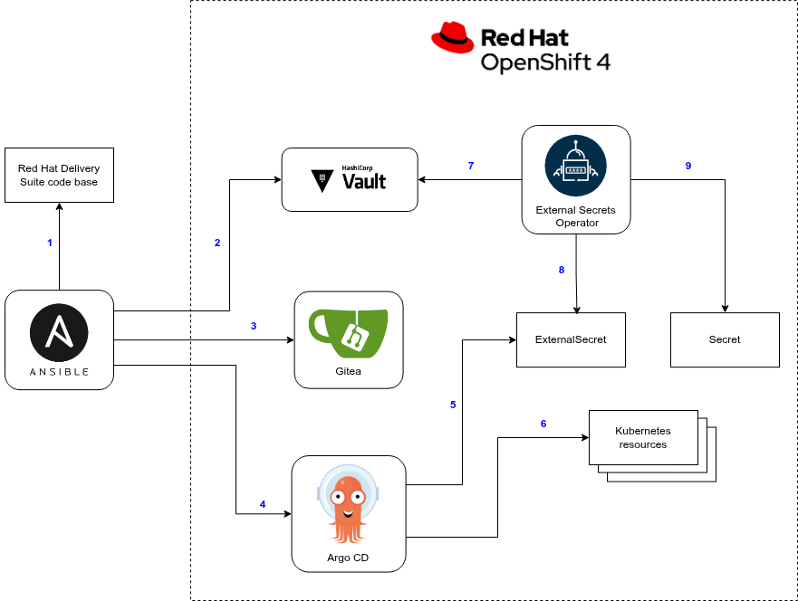

# AutoGitOps

AutoGitOps is a minimalist GitOps implementation for managing a single OpenShift cluster. AutoGitOps itself is deployed on the OpenShift cluster that it manages not depending on any external infrastructure components. The AutoGitOps deployment as well as the workflow is orchestrated by Ansible.

You can deploy AutoGitOps using the command:

```
$ ansible-playbook -i inventory/localhost.yml openshift_autogitops_deploy.yml
```

The above command deploys and configures the AutoGitOps components:
* Argo CD
* HashiCorp Vault
* Gitea
* External Secrets Operator

Once AutoGitOps is deployed, you can use it to deploy operators and configurations to the OpenShift cluster. The deployment is orchestrated by Ansible and consists of the following steps:
1. Ansible processes reads the role from the local checkout of `red-hat-delivery-suite` repository
2. Ansible uploads secrets into HashiCorp Vault
3. Ansible creates Kubernetes manifests and pushes them into Gitea
4. Ansible triggers the Argo CD application sync
5. Argo CD creates the ExternalSecret resources
6. Argo CD creates other Kubernetes resources defined in the Gitea repo
7. External Secrets Operator reads the ExternalSecret resources
8. External Secrets Operator pulls the secret data from HashiCorp Vault
9. External Secrets Operator creates Kubernetes Secrets holding the secret data


