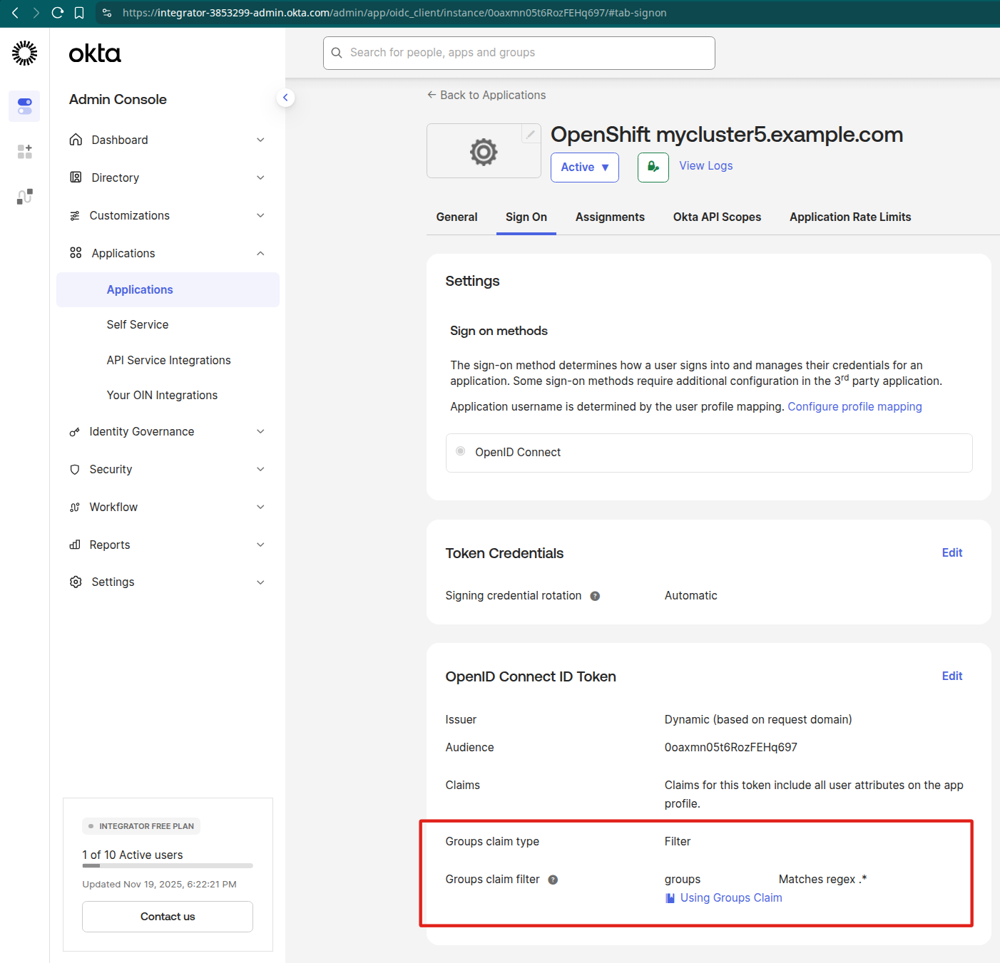

# Configuring Okta as an Identity Provider for OpenShift

To set up Okta as an OIDC provider for OpenShift, you may follow the article [How to Configure Okta as An Identity Provider for OpenShift](https://www.redhat.com/en/blog/how-to-configure-okta-as-an-identity-provider-for-openshift)

The aforementioned article does not mention the Okta configuration necessary for incorporating the `groups` claim into the access token. If you'd like OpenShift to generate groups and group membership based on the groups claim in the Okta token, it is required to configure Okta to include the groups claim in the token. Such an Okta configuration is described in the paragraph [Add a groups claim for the org authorization server](https://developer.okta.com/docs/guides/customize-tokens-groups-claim/main/#add-a-groups-claim-for-the-org-authorization-server) found in the Okta documentation.

The following screenshots illustrate the configuration:




On the OpenShift side,  it is essential to explicitly request the addition of the groups claim in the token, as demonstrated in this configuration:

```
apiVersion: config.openshift.io/v1
kind: OAuth
metadata:
  name: cluster
spec:
  - name: okta
    mappingMethod: claim
    type: OpenID
    openID:
      clientID: 0oaxmn05t6RozFEHq697
      clientSecret:
        name: openidconnect
      extraScopes:
      - email
      - profile
      # The "groups" scope must be explicitely requested
      # or Okta won't add groups claim to the token
      - groups
      extraAuthorizeParameters:
        include_granted_scopes: 'true'
      claims:
        preferredUsername:
        - preferred_username
        - email
        name:
        - name
        - email
        email:
        - email
        groups:
        - groups
      issuer: https://integrator-3853299-admin.okta.com
```

Once Okta and OpenShift has been set up, and the user has successfully logged into OpenShift, OpenShift will generate the corresponding user groups and include the user in those groups:

```
$ oc get group

```
```
NAME                                          USERS
Everyone                                      anosek@redhat.com
cluster-admins                                admin, anosek@redhat.com
mygroup1                                      anosek@redhat.com
open-cluster-management-subscription-admins   admin
```

```
$ oc get group cluster-admins -o yaml
```

```
apiVersion: user.openshift.io/v1
kind: Group
metadata:
  annotations:
    oauth.openshift.io/idp.okta: synced
  creationTimestamp: "2025-11-19T19:55:45Z"
  name: cluster-admins
  resourceVersion: "437771"
  uid: 0e8202e2-06c6-4f8a-879d-c7f25d6c25cf
users:
- admin
- anosek@redhat.com
```
