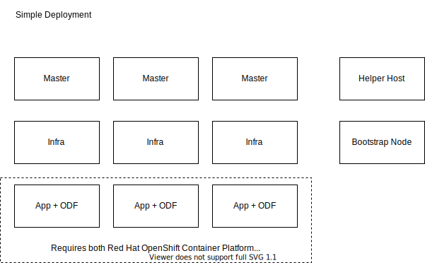
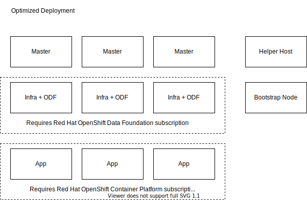
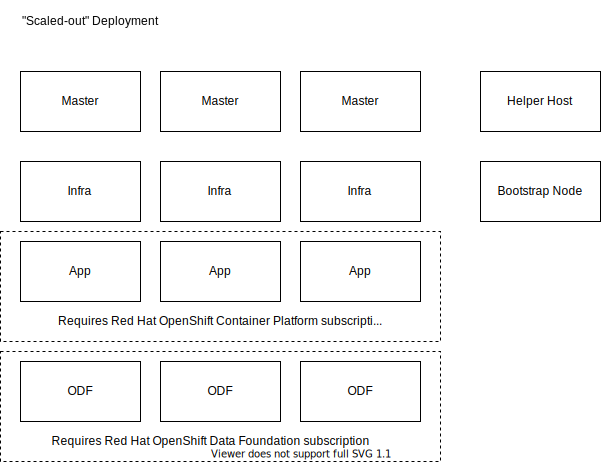

# Deployment Options

Node roles:
* Helper Host = Linux host used to run the OCP installer
* Bootstrap = ephemeral node needed for installation only
* Master = OpenShift control plane
* Infra = OpenShift router, logging, monitoring, and integrated image registry
* App = Application node
* OCS = Ceph control plane + data plane

## Simple Deployment

## Optimized Deployment

## Scaled-out Deployment

# Node Sizing

 Node Role | Count | vCPUs | Memory (GB)| Storage (GB)
--------- | ----- | ---- | ------ | -------
Helper Host | 1 | 2 | 8 | 40
Bootstrap | 1 | 4 | 16 | 120
Master | 3 | 8 | 24 | 120
Infra | 3 | 8 | 32 | 120
App | 3+ | 8+ | 32+ | 120
OCS | 3+ | 16 | 64 | 120
